# LEVEL UP! — die Story hinter dem Spiel

*Illustrierter Story-Leitfaden für den SHB Kundentag, 24.09.2026 — Motto: „LEVEL UP! – Der Weg zum Highscore"*

Studio Zundanus · Bilder: aktueller Live-Sprite-Stand des Spiels · Text: Zara/Milo-Kern, Marlene-Aufbereitung, Fable-Review.

Jede Etappe mit dem tatsächlichen Bild aus dem Spiel — zum direkten Vorlesen oder als Grundlage für eigene Folien.

---

## 1 · Der Held

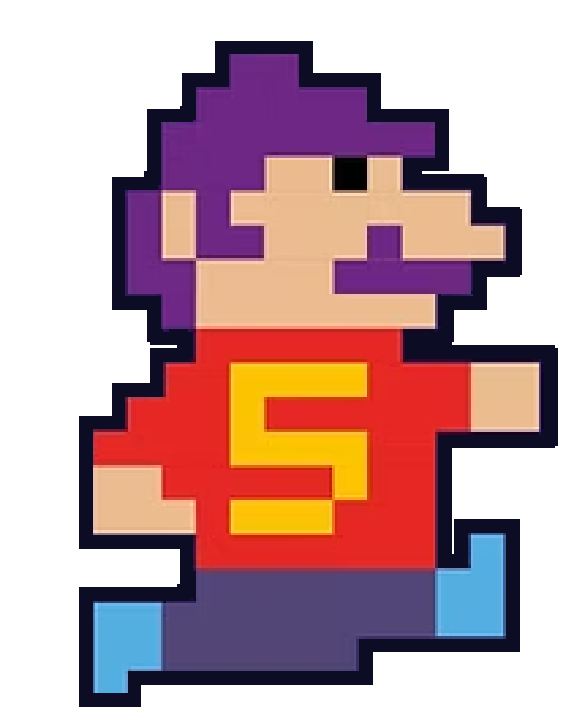

Die Spielfigur trägt ein Shirt mit der „5" — dem Erkennungszeichen vom Kundentag-Plakat. Wer den Controller (oder das Handy) in die Hand nimmt, übernimmt ihre Rolle: eine App bauen und sich Stufe für Stufe nach oben arbeiten.

---

## 2 · Die Hindernisse

| BUG | CONFIG | ANFORDERUNG | ENTWICKLUNG | SCHULUNG |
|:---:|:---:|:---:|:---:|:---:|
| 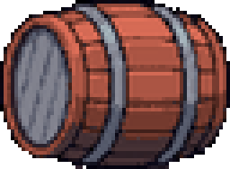 | 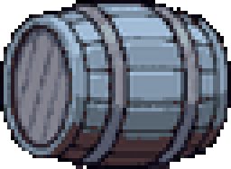 | 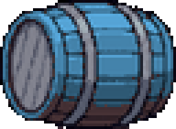 | 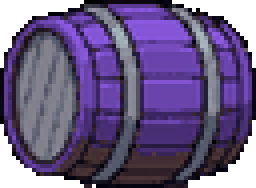 | 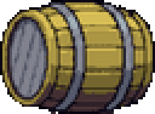 |

Auf dem Weg nach oben rollen ihr fünf Fass-Typen entgegen — Bug, Config, Anforderung, Entwicklung, Schulung. Das sind keine Gegner im klassischen Sinn, sondern Aufgaben, die erledigt werden wollen — der ganz normale Alltag in der Softwareentwicklung, den SHB für echte Kunden meistert. Am Stand sieht ein Erstspieler zuerst Bug und Config — der Rest kommt mit fortgeschrittenen Runden dazu.

---

## 3 · Der Aufstieg: Prototyp → Beta → Live

| Prototyp | → | Beta | → | Live |
|:---:|:---:|:---:|:---:|:---:|
| 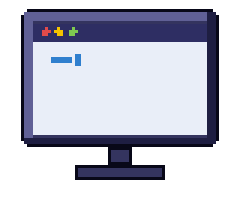 | 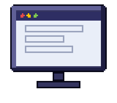 | 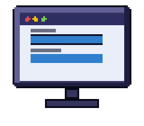 | 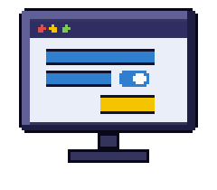 | 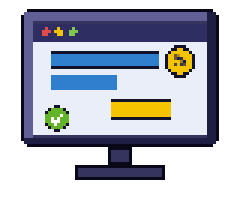 |

Fünf sichtbare Ausbaustufen, drei Meilensteine: Prototyp, Beta, Live. Der Bildschirm füllt sich von fast leer bis fertig — Feature für Feature. Sind genug Features geschafft, geht die App live.

---

## 4 · Der Gegenspieler

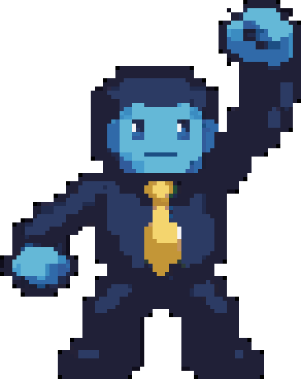

Oben steht der Gorillaman und wirft dem Helden die Hindernisse entgegen. Er sieht aus wie ein klassischer Antagonist — navy Anzug, goldene Krawatte — aber er ist kein Bösewicht. Er ist die Arbeit selbst, die erledigt werden muss.

---

## 5 · Der Twist: aus dem Gegner wird ein Kollege

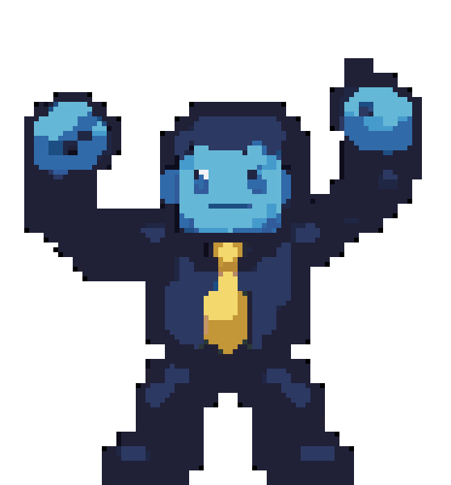

Sobald eine App live geht, ändert sich das Bild: Der Gorillaman hört auf zu werfen und jubelt stattdessen mit — Arme hoch, gleiche Figur, gleiche goldene Krawatte, aber jetzt auf der Seite des Helden. Der Gegner von eben wird zum Kollegen. Das ist der emotionale Kern des Spiels — und wiederholt sich mit jeder App, die im Spielverlauf live geht.

---

## Die Botschaft in einem Satz

**So entsteht Software wirklich: Feature für Feature — vom Prototyp über Beta bis Live — bis daraus eine fertige App wird. Und aus dem Gegner von eben wird ein Kollege.**

---

*→ [Spiel selbst anspielen](shb-dummy-embed.html) · [Wix-Einbau-Anleitung](wix-einbindung.md)*
